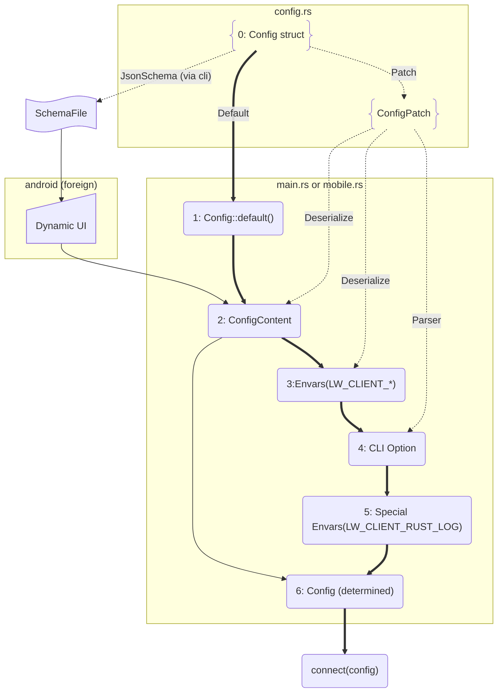

# Design Overview

## lightway-core

lightway-core is a small, multi-platform, Rust library that encapsulates the
encryption and processing of IP packets.

On its own, lightway-core is not an executable application. Instead, it is a
*purposefully* simple library. Intentionally, lightway-core is opinionated
about how it works and the scope it controls, and very agnostic about
everything else. The core use case of this library is as part of a
high-performance, always-on VPN application, which necessarily entails
deferring items like "how do I actually send UDP packets?" to the host
application, which can use the best API for the platform, be it a Windows
desktop or an iPhone.

## lightway-client

lightway-client is a fully working Lightway client implementation with TCP and UDP support across multiple platforms, including Windows, Linux, macOS, and mobile devices.

All client settings are centralized in a single [Config struct](/lightway-client/src/config.rs), designed to cover multiple use cases simultaneously. `Config` derives both `ConfigPatch` and JsonSchema file.

**Desktop client flow (steps 0, 1, 2, 3, 4, 5, 6):**

Starting from default values (0), the config evolves through each step along the bold lines. Meanwhile, ConfigPatch plays a central role along the dot lines, generating patches by deserializing from a file, environment variables, and CLI options — each applied as a layered override in sequence.

**Mobile client flow (steps 0, 1, 2, 6):**

Mobile takes a shorter path along the solid lines, joining into 2.ConfigContent of the flow chart. Rather than reading from a file, config content comes from a Dynamic UI. The Dynamic UI itself is driven by a JSON schema file generated at compile time from the same `Config` struct via the CLI client.
This means both desktop and mobile ultimately share the same `Config` source of truth, with the mobile flow being a streamlined subset of the desktop flow.



As shown, `Config` is the single source of truth for all clients — all user inputs, whether from a UI or a file,
flow through it. JSON schema generation from the CLI is designed to be a general-purpose mechanism for all client tooling.
The major clients are already implemented. When JSON schema support is needed for a new client,
the Android implementation serves as a practical reference to follow,
even though the broader approach to consuming JSON schema remains an open question in the [discussion](https://github.com/expressvpn/lightway/pull/411#discussion_r3166422937).

To add a platform-specific field, a feature gate is required — e.g. `#[cfg(feature = "...")]`
— with platform intent communicated via x-cfg and format attributes in the JSON schema.
This makes it easy to tailor the schema on the client side while still being generatable from the CLI.
That said, introducing more feature gates alongside existing target gates risks making the repo harder to follow.
To keep things clean, the practical approach with the least friction is:

1. Feature gates belong on **fields** of the `Config` struct.
2. `cfg` target attributes belong on **functions**.

Following this pattern, the feature gate lives only in `Config` and is handed off to the target gate in the function layer.
A further benefit is that functions sharing the same signature with `#[cfg(target)]` selection at compile time means a Windows developer and an Android developer work in almost the same domain language:

```rust
struct Config {
   #[cfg(feature="windows")]
   #[schemars(extend("x-cfg" = "windows"))]
   win_only_field: usize,
   
   #[cfg(feature="android")]
   #[schemars(extend("x-cfg" = "android"))]
   android_only_field: usize,
   // ...
}

fn main () {
   let config = Config::load();
   connect(config)
}

#[cfg(window)]
fn connect(config: Config) {
     let Config {
       win_only_field,
       ..
     } = config;
    
    if win_only_filed > 256 {
       // ...
    }
}

#[cfg(android)]
fn connect(config: Config) {
     let Config {
       android_only_field,
       ..
     } = config;
    let tun = Tun::new(android_only_field);
}
```

## lightway-server

lightway-server is a Linux implementation for a fully working Lightway server with both TCP and UDP support.

# Terminology

Some people may prefer to see these terms in context, see [What does it actually do?](#what-does-it-actually-do)

## Inside
Refers to data that will be wrapped or has already been unwrapped by lightway-core. This corresponds to data coming to / from the tun device.
## Outside
Refers to data wrapped by lightway-core. This corresponds to data coming to / from a network socket.
## Context
lightway-core attributes that may be shared across multiple connections
## Connection
lightway-core attributes that reflect a single wrapped data path between a client and server.

# What does it actually do?

At a very high-level, once a connection is established, lightway-core provides a bidirectional pathway for wrapping data in a way that can be securely sent over the internet.

One direction is the "inside path". The host application passes data to lightway-core for wrapping via `Connection.inside_data_received`, and then lightway-core will call the host application's `outside_io.send` one or more times with the appropriately encrypted data, which the host is then responsible for transmitting appropriately. Where "appropriately" normally means "send these packets over the internet, client->server or server->client depending on which side of the connection we are on."

The other direction is the "outside path". The host application passes data wrapped by lightway-core to the appropriate library function `Connection.outside_data_received`; lightway-core will then call the host application's `inside_io.send` one or more times with the appropriately unwrapped data, which the host can then deliver the data into the tun device.

Of course, the devil is in the details, and there are a lot of details here. For an example of how the above works you can see [IP Translation](./ip_translation.md#packet-flow-steps-as-marked-yellow-in-above-picture)
