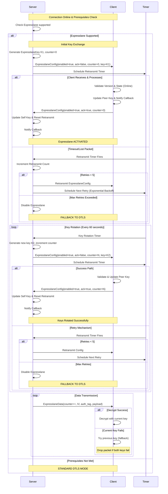

# Expresslane Documentation

## Overview

Expresslane is a performance optimization feature for the Lightway VPN protocol that fundamentally changes how data packets are encrypted and transmitted to achieve superior throughput and reduced latency. By implementing a sophisticated dual-path encryption architecture, Expresslane addresses the inherent performance bottlenecks of DTLS-encrypted VPN tunnels while maintaining the highest standards of cryptographic security.

This feature introduces an approach where control plane communications (authentication, key exchange, connection management) continue to use the robust DTLS encryption layer, while data plane traffic (actual user data packets) is processed through a streamlined AES-256-GCM encryption path that bypasses DTLS overhead entirely. This architectural separation allows Expresslane to deliver the security guarantees of enterprise-grade VPN encryption while achieving performance characteristics typically associated with much lighter security protocols.

Expresslane is specifically engineered for UDP-based connections, particularly beneficial for high-bandwidth applications such as video streaming, real-time communications, file transfers, and other latency-sensitive workloads that demand both security and performance.

## Architecture and Design

### Core Concept

Previously, Lightway applied uniform encryption overhead to all traffic, treating control messages and bulk data identically. This approach, while secure, creates unnecessary performance bottlenecks for data-intensive applications. Expresslane's design philosophy centers on the recognition that different types of network traffic have different security and performance requirements.

Expresslane implements a dual-encryption architecture that optimizes each traffic type:

**Control Path (DTLS-Encrypted):**
- Authentication handshakes and certificate validation
- Key exchange and cryptographic parameter negotiation
- Connection state management and keep-alive messages
- Configuration updates and protocol control frames
- Error handling and connection recovery procedures

**Data Path (Expresslane-Encrypted):**
- User application data (web traffic, file transfers, streaming)
- Any payload data after successful connection establishment

This separation allows each path to be optimized for its specific requirements: the control path prioritizes maximum security and reliability, while the data path prioritizes performance while maintaining strong cryptographic protection. The result is a protocol that delivers enterprise-grade security without compromising on the performance characteristics demanded by modern applications.

### Key Components

#### 1. Expresslane Data Encryption (`expresslane_data.rs`)

The data encryption component represents the heart of Expresslane's performance optimization, implementing a highly efficient cryptographic pipeline designed for maximum throughput with minimal computational overhead.

The following describes the wire format of the expresslane data packet:

```
 0                   1                   2                   3
 0 1 2 3 4 5 6 7 8 9 0 1 2 3 4 5 6 7 8 9 0 1 2 3 4 5 6 7 8 9 0 1
+-+-+-+-+-+-+-+-+-+-+-+-+-+-+-+-+-+-+-+-+-+-+-+-+-+-+-+-+-+-+-+-+
|                    Packet Counter (64-bit)                   |
+-+-+-+-+-+-+-+-+-+-+-+-+-+-+-+-+-+-+-+-+-+-+-+-+-+-+-+-+-+-+-+-+
|                    Counter (continued)                       |
+-+-+-+-+-+-+-+-+-+-+-+-+-+-+-+-+-+-+-+-+-+-+-+-+-+-+-+-+-+-+-+-+
|                 Initialization Vector (IV)                   |
+-+-+-+-+-+-+-+-+-+-+-+-+-+-+-+-+-+-+-+-+-+-+-+-+-+-+-+-+-+-+-+-+
|                      IV (continued)                          |
+-+-+-+-+-+-+-+-+-+-+-+-+-+-+-+-+-+-+-+-+-+-+-+-+-+-+-+-+-+-+-+-+
|                      IV (continued)                          |
+-+-+-+-+-+-+-+-+-+-+-+-+-+-+-+-+-+-+-+-+-+-+-+-+-+-+-+-+-+-+-+-+
|                   Authentication Tag                         |
+-+-+-+-+-+-+-+-+-+-+-+-+-+-+-+-+-+-+-+-+-+-+-+-+-+-+-+-+-+-+-+-+
|                 Authentication Tag (continued)               |
+-+-+-+-+-+-+-+-+-+-+-+-+-+-+-+-+-+-+-+-+-+-+-+-+-+-+-+-+-+-+-+-+
|                 Authentication Tag (continued)               |
+-+-+-+-+-+-+-+-+-+-+-+-+-+-+-+-+-+-+-+-+-+-+-+-+-+-+-+-+-+-+-+-+
|                 Authentication Tag (continued)               |
+-+-+-+-+-+-+-+-+-+-+-+-+-+-+-+-+-+-+-+-+-+-+-+-+-+-+-+-+-+-+-+-+
|    Data Length (16-bit)       |         Reserved (16-bit)     |
+-+-+-+-+-+-+-+-+-+-+-+-+-+-+-+-+-+-+-+-+-+-+-+-+-+-+-+-+-+-+-+-+
|                    Encrypted Payload Data                    |
~                                                               ~
```

**Field Descriptions**:
- **Counter (8 bytes)**: Monotonic packet sequence number for replay protection and IV construction
- **IV (12 bytes)**: Cryptographically random initialization vector, unique per packet
- **Authentication Tag (16 bytes)**: GCM authentication tag ensuring packet integrity and authenticity
- **Data Length (2 bytes)**: Encrypted payload size (less than TUN mtu size)
- **Reserved (2 bytes)**: Reserved bytes for future use and alignment
- **Encrypted Payload**: Variable-length user data encrypted with AES-256-GCM

#### 2. Expresslane Configuration (`expresslane_config.rs`)

The configuration component manages the key distribution and synchronization between VPN peers, ensuring that both endpoints maintain synchronized cryptographic state for seamless data path encryption.

The following describes the wire format of the expresslane config packet:

```
 0                   1                   2                   3
 0 1 2 3 4 5 6 7 8 9 0 1 2 3 4 5 6 7 8 9 0 1 2 3 4 5 6 7 8 9 0 1
+-+-+-+-+-+-+-+-+-+-+-+-+-+-+-+-+-+-+-+-+-+-+-+-+-+-+-+-+-+-+-+-+
|   version     |E|A|   unused  |      Reserved                 |
+-+-+-+-+-+-+-+-+-+-+-+-+-+-+-+-+-+-+-+-+-+-+-+-+-+-+-+-+-+-+-+-+
|                          Counter                              |
+-+-+-+-+-+-+-+-+-+-+-+-+-+-+-+-+-+-+-+-+-+-+-+-+-+-+-+-+-+-+-+-+
|                          Counter                              |
+-+-+-+-+-+-+-+-+-+-+-+-+-+-+-+-+-+-+-+-+-+-+-+-+-+-+-+-+-+-+-+-+
|                           Key                                 |
+-+-+-+-+-+-+-+-+-+-+-+-+-+-+-+-+-+-+-+-+-+-+-+-+-+-+-+-+-+-+-+-+
|                           Key                                 |
+-+-+-+-+-+-+-+-+-+-+-+-+-+-+-+-+-+-+-+-+-+-+-+-+-+-+-+-+-+-+-+-+
|                           Key                                 |
+-+-+-+-+-+-+-+-+-+-+-+-+-+-+-+-+-+-+-+-+-+-+-+-+-+-+-+-+-+-+-+-+
|                           Key                                 |
+-+-+-+-+-+-+-+-+-+-+-+-+-+-+-+-+-+-+-+-+-+-+-+-+-+-+-+-+-+-+-+-+
|                           Key                                 |
+-+-+-+-+-+-+-+-+-+-+-+-+-+-+-+-+-+-+-+-+-+-+-+-+-+-+-+-+-+-+-+-+
|                           Key                                 |
+-+-+-+-+-+-+-+-+-+-+-+-+-+-+-+-+-+-+-+-+-+-+-+-+-+-+-+-+-+-+-+-+
|                           Key                                 |
+-+-+-+-+-+-+-+-+-+-+-+-+-+-+-+-+-+-+-+-+-+-+-+-+-+-+-+-+-+-+-+-+
|                           Key                                 |
+-+-+-+-+-+-+-+-+-+-+-+-+-+-+-+-+-+-+-+-+-+-+-+-+-+-+-+-+-+-+-+-+
```

**Field Descriptions**:
- **Version (1 byte)**: Expresslane version
- **E(nabled) flag (1 bit)**: Whether Expresslane is enabled or not
- **A(ck) flag (1 bit)**: value of 1 indicates acknowledgement packet
- **Unused (6 bits)**: Reserved for future use
- **Reserved (2 bytes)**: Reserved for future use
- **Counter (8 bytes)**: Counter to use as IV for AesGcm crypto
- **Key (32 bytes)**: AesGcm256 key (256 bits)


## API Changes and New Components

### New Types and Structures

#### `ExpresslaneKey`
```rust
pub struct ExpresslaneKey(pub [u8; 32]);
```
- 256-bit AES-GCM encryption key
- Implements cryptographic random generation
- Used for both sending and receiving

#### `ExpresslaneCbData`
```rust
pub struct ExpresslaneCbData {
    pub self_key: ExpresslaneKey,
    pub peer_key: ExpresslaneKey,
}
```
- Key notification structure for external components
- Provides both local and peer keys for key management

#### `ExpresslaneCb` Trait
```rust
pub trait ExpresslaneCb {
    fn update(&self, session_id: SessionId, data: ExpresslaneCbData);
}
```
- Callback interface for key updates
- Enables external key management

### New Message Types

#### Expresslane Config frames (Frame Type 20)
- Carries key exchange information
- Sent when keys are rotated
- Processed during online state only

#### Expresslane Data packets
- Not a traditional lightway frame, but encrypted payloads with only wire::Header
- Identified by `expresslane_data` header flag
- Bypass normal frame processing pipeline

## Protocol Behavior

### Feature Activation Conditions

Expresslane employs a negotiation system to ensure backward compatibility.
The feature is automatically enabled when all prerequisite conditions are satisfied, providing seamless transparent acceleration for compatible connections.

**Requirements** (all conditions must be met):

1. Datagram (UDP) transport protocol
2. Lightway Protocol v1.3 or newer
3. No conflicting inside packet encoders active
4. Successful key exchange completion

**Automatic Fallback Behavior**:

When any condition is not met, connections automatically fall back to standard DTLS encryption with no user intervention required.

### Key Lifecycle Management



### Packet Processing Flow

#### Transmission (Egress)
1. Check if Expresslane is supported and ready
2. Generate random IV using cryptographic RNG
3. Increment packet counter
4. Encrypt data using AES-256-GCM
5. Send packet with `expresslane_data` header flag set

#### Reception (Ingress)
1. Detect Expresslane packet via header flag
2. Extract counter, IV, auth tag, and encrypted data
3. Attempt decryption with current key
4. Fall back to previous key if current fails
5. Forward decrypted data to inside interface

### Security Considerations

#### Cryptographic Properties
- **Encryption**: AES-256-GCM (authenticated encryption)
- **Key Size**: 256 bits (32 bytes)
- **IV Size**: 96 bits (12 bytes) - cryptographically random
- **Auth Tag**: 128 bits (16 bytes)

#### Authentication Vector
- Combines session ID (8 bytes) + packet counter (8 bytes)
- Provides replay protection and session binding

#### Fallback Mechanism
- Always attempts current key first
- Falls back to previous key if decryption fails
- Provides seamless key rotation without packet loss

