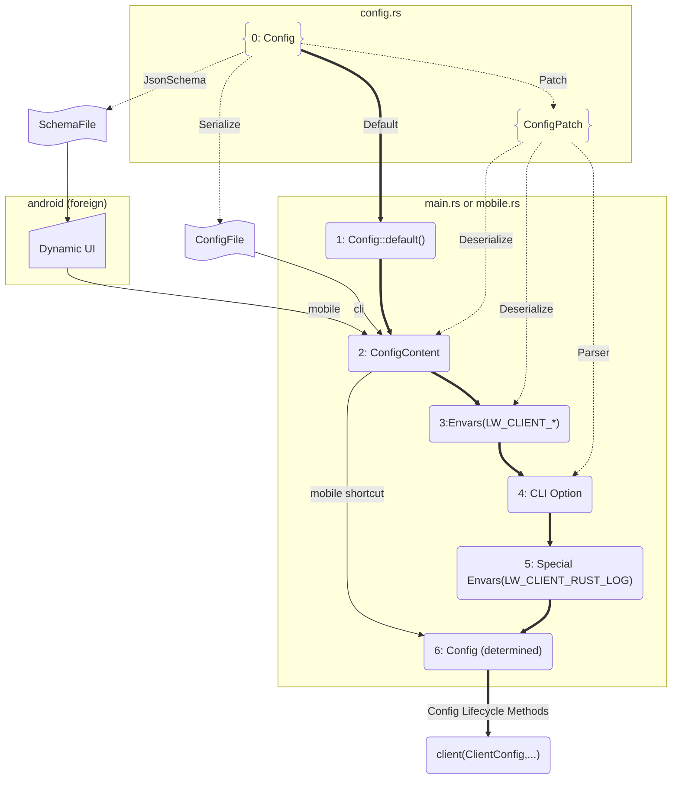

# General Config Design Rationale

## Introduction

The config generation is unified across all clients and the server. For the server, the scope is simple — it only supports native builds on Linux. For the client side, real-world usage is considerably broader, particularly when generating JSON schema for any platform target from a macOS machine, which is a common working scenario for a small team.

This document is not meant to impose restrictions on development. Instead, it addresses development pain points ahead of time by providing guides that help you leverage what is currently available.

---

## Methods

### Config as Single Source of Truth

`Config` is the single source of truth for all clients — all user inputs, whether from a UI or a file, flow through it. JSON schema generation from the CLI is designed to be a general-purpose mechanism for all client tooling.

`Config` derives both `ConfigPatch` and `JsonSchema`, which enables the layered override flow described below.

### Config Flow

**Desktop client flow (steps 0–6):**

Starting from default values (0), the config evolves through each step along the bold lines. `ConfigPatch` plays a central role along the dot lines, generating patches by deserializing from a file, environment variables, and CLI options — each applied as a layered override in sequence.

**Mobile client flow (steps 0, 1, 2, 6):**

Mobile takes a shorter path, skipping the intermediate steps after `2.ConfigContent`. Rather than reading from a file, config content comes from a Dynamic UI driven by a JSON schema file generated at compile time from the same `Config` struct via the CLI client. Both desktop and mobile ultimately share the same `Config` source of truth, with the mobile flow being a streamlined subset.

**Server flow (steps 0–6):**

Identical to the CLI client flow, but all parameters use `SERVER` keywords — e.g. `LW_CLIENT_*` becomes `LW_SERVER_*`.



### Design Principles

When adding a platform-specific field, a feature gate may be required — e.g. `#[cfg(feature = "...")]` — with platform intent communicated via `x-cfg` and `format` attributes in the JSON schema. Critically, `#[cfg(target)]` must **not** be applied to fields: if it were, those fields would be absent when generating schema on a non-matching host, making it impossible to generate all schemas from any desktop machine.

To keep things clean, the practical approach with the least friction is:

1. Feature gates (if used) belong on **fields** of the `Config` struct — never with a target gate.
2. `cfg` target attributes belong on **functions**.

Following this pattern, the feature gate lives only in `Config` and is handed off to the target gate in the function layer. A further benefit is that functions sharing the same signature with `#[cfg(target)]` selection at compile time means a Windows developer and an Android developer work in almost the same domain language:

```rust
struct Config {
   #[cfg(feature="windows")] // optional
   #[schemars(extend("x-cfg" = "windows"))]
   win_only_field: usize,

   #[cfg(feature="android")] // optional
   #[schemars(extend("x-cfg" = "android"))]
   android_only_field: usize,
   // ...
}

fn main() {
   let config = Config::load();
   client(config)
}

#[cfg(windows)]
fn client(config: Config) {
     let Config { win_only_field, .. } = config;
    if win_only_field > 256 {
       // ...
    }
}

#[cfg(android)]
fn client(config: Config) {
     let Config { android_only_field, .. } = config;
    let tun = Tun::new(android_only_field);
}
```

### Config Lifecycle Methods

After the config is fully determined (step 6), three methods bridge it into the client runtime. `validate()` and `take_servers()` are methods on `Config`; `try_from_reload_sig_and_config()` is a constructor on `ClientConfig`.

Typical call site order in `main.rs`:

```rust
config.validate()?;                             // fail fast before logging or other setup
let servers = config.take_servers()?;           // normalize servers, transfer ownership
let client_config = ClientConfig::<()>::try_from_reload_sig_and_config(
    config_reload_signal,
    config,
)?;
// servers and client_config are then used independently
```

#### `validate()`

Checks the fully determined `Config` for conflicts and invalid values (mismatched socket-buffer or PMTUD settings on TCP, invalid Windows TUN parameters). Called independently in `main.rs` as the first step after config is determined, so validation fails fast before any further setup (logging, server normalization, runtime construction).

#### `take_servers()`

Must be called **before** constructing `ClientConfig`. It normalizes the config's flexible server representation — promoting single-server top-level fields, resolving CA certificates, and propagating auth credentials — and transfers ownership of the resulting `Vec<ConnectionConfig>` out of `Config`. All downstream consumers work against a uniform server list regardless of how the original config was expressed.

#### `try_from_reload_sig_and_config()`

The canonical constructor for `ClientConfig`. It consumes `config` (after `validate()` and `take_servers()` have been called), builds `TunConfig`, and wires up the optional `config_reload_signal` for hot-reload support.

---

## Results

### Current State (Status 0): Mobile Only

JSON schema generation is currently only supported for mobile clients. Existing clients do not use JSON schema and do not yet follow this design. When JSON schema support is needed for a new client, the Android implementation serves as a practical reference.

| Persona | Use Case | Command |
|---|---|---|
| Native developer | Windows build | `cargo build` |
| Native developer | macOS build | `cargo build` |
| Cross-platform developer | Mobile from desktop | `cargo build --feature=mobile` |
| Frontend / Designer | Android schema from Linux | `cargo run -g jsonschema --all-features` |
| Frontend / Designer | All schema from any desktop | **Not yet supported** |

### Extended Personas

Previous clients were built in a straightforward native way. Introducing the mobile feature and JSON schema expanded the scope of use cases beyond native development, extending the user personas from 1 to 3:

- **Native developer** — builds on the target machine directly.
- **Cross-platform developer** — cross-compiles for a different target from their own machine.
- **Frontend / Designer** — generates JSON schema to build and design a dynamic UI, without needing a target-specific machine.

This broader scope is key infrastructure not just for internal use, but for the wider Lightway community and external developers.

---

## Discussion

### Future Plans

Both options below share a common goal: enabling developers, frontend engineers, and designers to generate and tailor the config or schema from any working branch without needing a specific target machine.

#### Option 1: Align All Clients with Feature Gates in Config *(Preferred)*

| Persona | Use Case | Command |
|---|---|---|
| Native developer | Windows build | `cargo build --feature=windows` |
| Native developer | macOS build | `cargo build --feature=macos` |
| Cross-platform developer | Mobile from desktop | `cargo build --feature=mobile` |
| Frontend / Designer | All schema from any desktop | `cargo run -g jsonschema --all-features` |

No extra fields are compiled in for any use case — every field is exactly what the target needs. Specifying both a feature and a target flag can feel verbose, but since builds are already wrapped in `Makefile.toml`, this is easily managed without affecting day-to-day usage. The design principles above — feature gates on fields, `cfg` targets on functions — apply specifically to this option.

#### Option 2: Keep All Extra Fields without Feature or Target Gates

| Persona | Use Case | Command |
|---|---|---|
| Native developer | Windows build | `cargo build` |
| Native developer | macOS build | `cargo build` |
| Cross-platform developer | Mobile from desktop | `cargo build` |
| Frontend / Designer | All schema from any desktop | `cargo run -g jsonschema` |

This always compiles extra fields into the config regardless of the target, and is syntactically inconsistent with the cross-build cases. While native builds appear simpler with no feature flag, since builds are invoked through `Makefile.toml` rather than `cargo build` directly, that surface simplicity does not translate into a real workflow benefit.

### Open Question

The broader approach to consuming JSON schema across all clients remains an open question. See the ongoing [discussion](https://github.com/expressvpn/lightway/pull/411#discussion_r3166422937) for context. A consensus between Option 1 and Option 2 is needed before proceeding with further client adoption.
