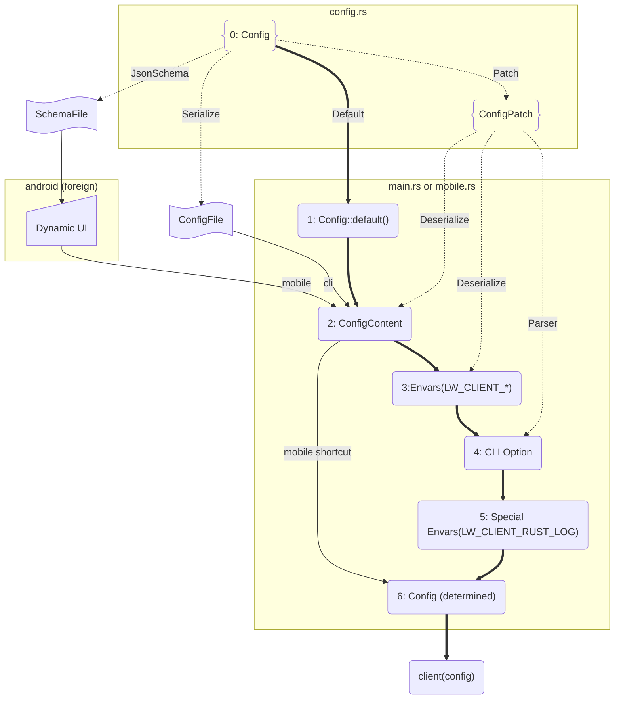

# General Config Design Rationale

## Introduction 

The config generation is unified on all clients and server.  For the server part, it is quite simple as it only supports native builds on top of Linux.  
For the client side, we need to consider much more in real-world usage.  This document is not meant to set rules to restrict the development, but to address development pain points ahead of time by providing guides that help you leverage what we currently have.

## Use cases with personas

In our previous works, we rolled out different clients in a straightforward way by building the client on top of the target machines; these are the native development cases.
When the mobile feature was added to the project and JsonSchema was introduced, the scope of use cases became broader than before, including cross compiling cases, and the need for providing a general UI.
This extended the user personas from 1 (native developer only) to 3.
This is not a hard requirement when we are building tools ourselves, because we have all kinds of machines we need.
However, this is key infrastructure for the Lightway community or external developers; even a small team of developers from different backgrounds can more easily leverage Lightway.
For now, we remain at `Status 0` and are not requiring all clients to adopt the new design. Instead, we point out possible paths forward for leveraging JSON schema more broadly — as a guide, not a rule.

---

Status 0: Only mobile clients with feature gates in Config

- Native developer:
  - Windows: `cargo build`
  - MacOS: `cargo build`
- Cross-platform developer:
  - Mobile from desktop: `cargo build --feature=mobile`
- Frontend / Designer:
  - Android schema from Linux: `cargo run -g jsonschema --all-features` (Only mobile)
  - All schema from any desktop: **Not supported** (Other clients still based on platform gate)

---

Option 1: Align all clients with feature gates in Config

- Native developer:
  - Windows: `cargo build --feature=windows`
  - MacOS: `cargo build --feature=macosx`
- Cross-platform developer:
  - Mobile from desktop: `cargo build --feature=mobile`
- Frontend / Designer:
  - All schema from any desktop: `cargo run -g jsonschema --all-features`

There are no extra fields compiled in for any use case — every field is exactly what the target needs — but specifying both a feature and a target flag can be verbose.
The verbosity can be addressed by Makefile or scripts, we already use them.

---

Option 2: Keep all extra fields in Config without feature or target gates

- Native developer:
  - Windows: `cargo build`
  - MacOS: `cargo build`
- Cross-platform developer:
  - Mobile from desktop: `cargo build --feature=mobile`
- Frontend / Designer:
  - All schema from any desktop: `cargo run -g jsonschema`

This is simpler to use, but always compiles extra fields into the config regardless of the target, and is syntactically inconsistent with the cross-build cases.

---

In both options, developers, frontend engineers, and designers retain the ability to generate and tailor the config or schema from any working branch without needing a specific target machine.

## Current flow with mobile feature

**Desktop client flow (steps 0, 1, 2, 3, 4, 5, 6):**

Starting from default values (0), the config evolves through each step along the bold lines. Meanwhile, ConfigPatch plays a central role along the dot lines, generating patches by deserializing from a file, environment variables, and CLI options — each applied as a layered override in sequence.

**Mobile client flow (steps 0, 1, 2, 6):**

Mobile takes a shorter path, skipping the steps after **2.ConfigContent** in the flow chart. Rather than reading from a file, config content comes from a Dynamic UI. The Dynamic UI itself is driven by a JSON schema file generated at compile time from the same `Config` struct via the CLI client.
This means both desktop and mobile ultimately share the same `Config` source of truth, with the mobile flow being a streamlined subset of the desktop flow.

**Server flow (steps 0, 1, 2, 3, 4, 5, 6):**

The flow is exactly the same as the CLI client, but all parameters use SERVER keywords, e.g.: `LW_CLIENT_*` will be `LW_SERVER_*`.




## Possibilities for all clients from a General Config

As shown, `Config` is the single source of truth for all clients — all user inputs, whether from a UI or a file,
flow through it. JSON schema generation from the CLI is designed to be a general-purpose mechanism for all client tooling.
The major clients are already implemented, so the existing clients do not use JSON schema and do not follow the current design.
When JSON schema support is needed for a new client, the Android implementation serves as a practical reference to follow,
even though the broader approach remains an open question in the [discussion](https://github.com/expressvpn/lightway/pull/411#discussion_r3166422937).

When adding a platform-specific field, a feature gate is required — e.g. `#[cfg(feature = "...")]`
— with the platform intent communicated via `x-cfg` and `format` attributes in the JSON schema.
This makes it easy to tailor the schema on the client side while still being generatable from the CLI.
Note that there is no `#[cfg(target)]` when using JsonSchema, otherwise some fields would be missing, making it impossible to fulfill the goal — All schema from any desktop.
That said, introducing more feature gates alongside existing target gates risks making the repo harder to follow.
To keep things clean, the practical approach with the least friction is:

1. Feature gates belong on **fields** of the `Config` struct (Only needed in Option 1 approach)
2. `cfg` target attributes belong on **functions**.

Following this pattern, the feature gate lives only in `Config` and is handed off to the target gate in the function layer when using Option 1 approach.
A further benefit is that functions sharing the same signature with `#[cfg(target)]` selection at compile time means a Windows developer and an Android developer work in almost the same domain language:

```rust
struct Config {
   #[cfg(feature="windows")]  // No need in Option 2
   #[schemars(extend("x-cfg" = "windows"))]
   win_only_field: usize,
   
   #[cfg(feature="android")]  // No need in Option 2
   #[schemars(extend("x-cfg" = "android"))]
   android_only_field: usize,
   // ...
}

fn main () {
   let config = Config::load();
   client(config)
}

#[cfg(windows)]
fn client(config: Config) {
     let Config {
       win_only_field,
       ..
     } = config;
    if win_only_field > 256 {
       // ...
    }
}

#[cfg(android)]
fn client(config: Config) {
     let Config {
       android_only_field,
       ..
     } = config;
    let tun = Tun::new(android_only_field);
}
```
